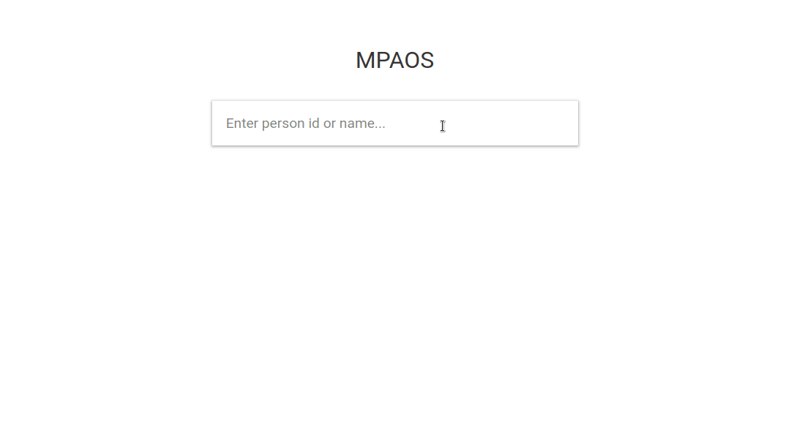

# mpaos

Client application of [ryhnnl/hello](https://github.com/ryhnnl/hello) written in React.js.
A part of 4th Assignment of Engineering Project.

## Download

Git clone:

`git clone git@github.com:ryhnnl/mpaos.git`

Cd into mpaos:

`cd mpaos`

Install packages:

`npm i`

## Run

First, run the hello api to make application work properly.

`npm run start:dev`

